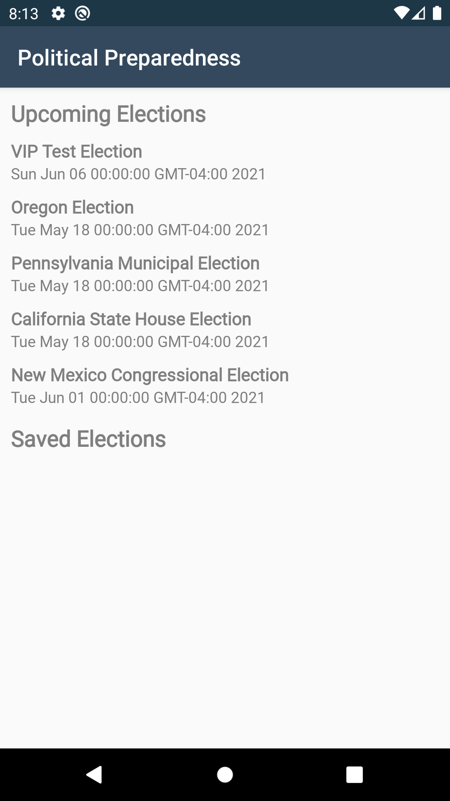

# README Template
This project is part of Android Kotlin Developer Course from Udacity.

# Project Title

Political Preparedness.

## Getting Started

You can clone this project and run your local machine or you can download the Apk for test.

### Components and Architecture

This Project was built by using Android Jetpack components and following best practices and recommended architecture.

## Project Instructions

The Apk binary could be found in the folder **/starter/apk/politicalpreparedness.apk**

## Screens

### Home Screen
The home screen must have an options to **Find My Representations** and **Upcoming Elections**.

### Upcoming Elections
In this screen we can must have **Upcoming Elections** and **Saved Elections** list.

| Upcoming Elections  |  Saved Elections  |
| ------------------- | ------------------- |
|   |   |

### Voter Information
When click in some election item in the upcoming or saved election list we can must go to the **Voter Information Screen**, and see some details about the selected election. Then, the App must have an options to **follow** and **unfollow** any election. Followed elections must be shown in the **Saved Election** list.

| Follow Elections  |  Unfollow Elections  |
| ------------------- | ------------------- |
|   |   |

### Find My Representations
In this screen we must search representations by addrees information. The address can be filled by **use my location** using the device's location feature or entered manually.
The address form must be hidden when scroll my representatives list.
When clicking on the icons of the website, facebook or twitter the url must open in the external browser.

| Find My Representations  |  Use my location  | Address filled  | 
| ------------------- | ------------------- | ------------------- |
|   |   |  |

| My Representations List  |  Hide Address Form  | 
| ------------------- | ------------------- |
|   |   | 

